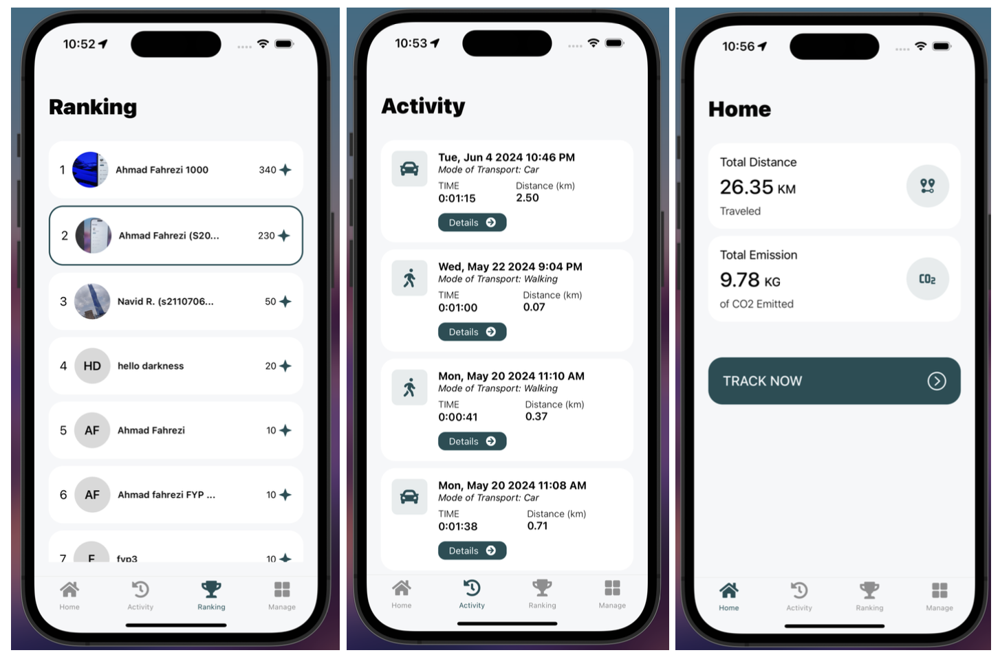
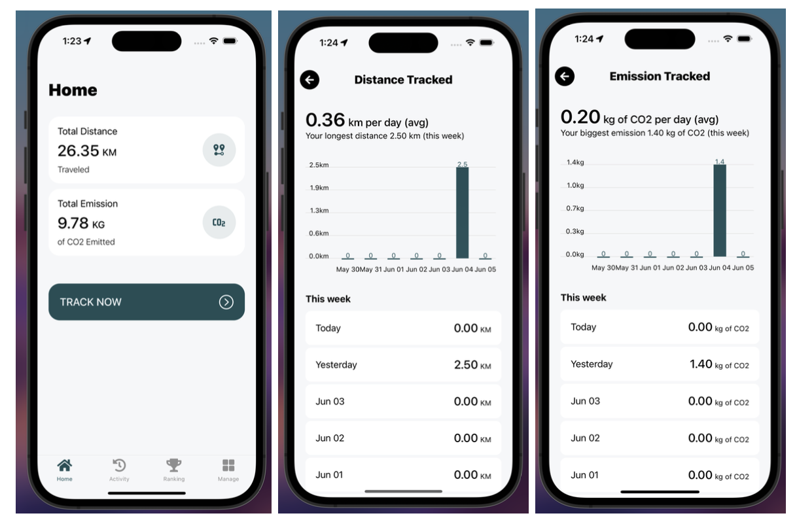
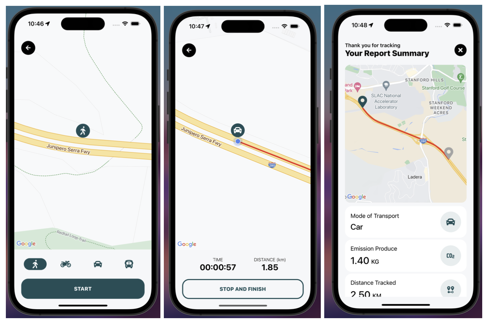
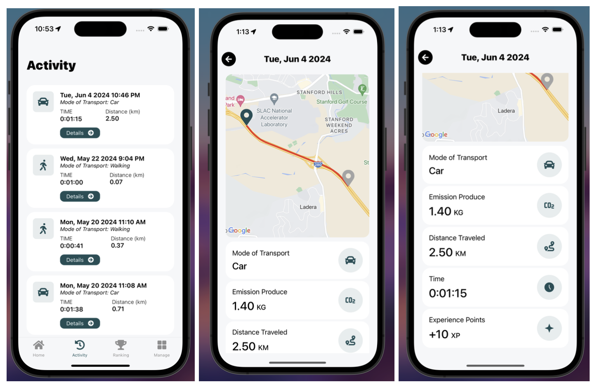

# Eco-Mobility 🍃

Eco-Mobility is a mobile application designed to promote eco-friendly transportation habits among users. The app tracks various activities, calculates CO2 emissions, and provides insightful charts and summaries to help users understand their environmental impact.
### Project Demo

Check out our [video demonstration](https://drive.google.com/file/d/1uZuzMDYD8rTO7otuSTFCPDF7vLcXapGo/view) to see the project in action.

## Features

- **Activity Tracking**: Track your transportation activities and view detailed summaries.
- **CO2 Emission Calculation**: Calculate the CO2 emissions based on your activities.
- **Charts and Graphs**: Visualize your data with interactive charts and graphs.
- **User Authentication**: Secure user authentication with Firebase.
- **Profile Management**: Manage your profile and view your achievements.

## Technologies Used

- **React Native**: For building the mobile application.
- **Firebase**: For authentication, Firestore database, and storage.
- **Expo**: For development and deployment.
- **TypeScript**: For type-safe JavaScript.

## Installation

1. Clone the repository:

   ```sh
   mkdir eco-mobility
   cd eco-mobility
   ```

   ```sh
   git clone https://github.com/ahmadfahrezi81/Eco-Mobility.git
   ```
2. Install dependencies:
   You can use either ⁠npm or ⁠pnpm to install the dependencies. Here are the commands for each:

   Using PNPM:

   ```sh
   pnpm install
   ```

   Alternatively, using NPM:

   ```sh
   npm install
   ```
3. Set up environment variables:
   Create a [.env](http://_vscodecontentref_/0) file in the root directory and add your Firebase configuration:

   ```env
   API_KEY=your_api_key
   AUTH_DOMAIN=your_auth_domain
   PROJECT_ID=your_project_id
   STORAGE_BUCKET=your_storage_bucket
   MESSAGING_SENDER_ID=your_messaging_sender_id
   APP_ID=your_app_id
   ```
4. Start the application:

   ```sh
   npx run dev
   ```

## Usage

1. Sign up or log in using your email.
2. Start tracking your activities.
3. View your CO2 emissions and other statistics in the charts.
4. Manage your profile.
5. Check the leaderboard to see how you rank against other users.

## Screenshots

### Main Screen



### Dashboard



### Tracking



### Activity



## Contributing

We welcome contributions! Please read our Contributing Guidelines for more details.

## Contributing Guidelines

1. Fork the repository.
2. Create a new branch for your feature or bugfix:
   ```sh
   git checkout -b feature/your-feature-name
   ```
3. Make your changes and commit them with clear and concise messages.
4. Push your changes to your forked repository:
   ```sh
   git push origin feature/your-feature-name
   ```
5. Create a pull request to the main repository. Provide a detailed description of your changes and any related issues.

## License

This project is licensed under the MIT License. See the LICENSE file for details.

## Contact

For any inquiries, please contact Ahmad Fahrezi at ahmadfahrezi8127@gmail.com.
